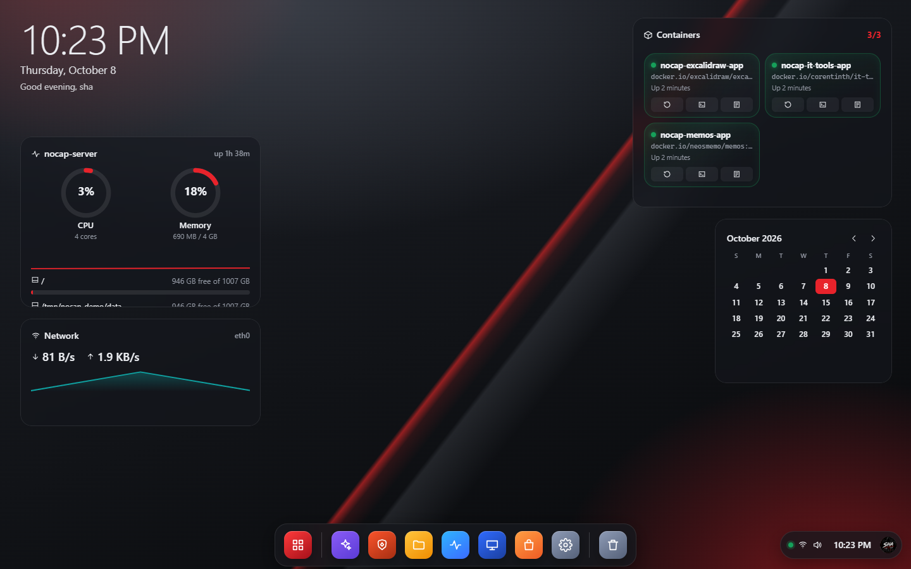
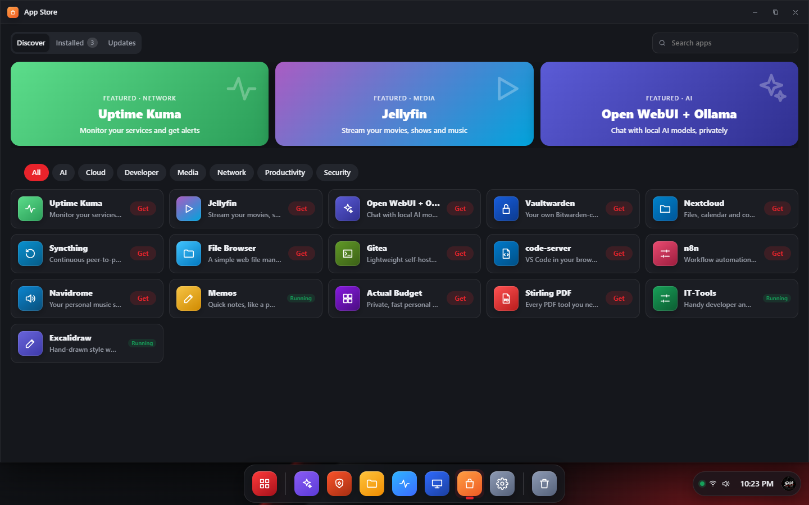
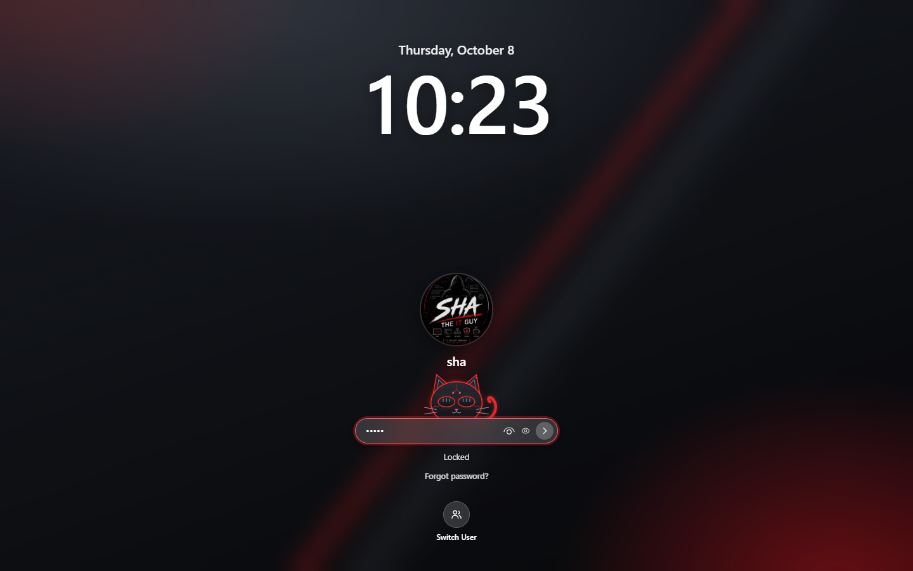
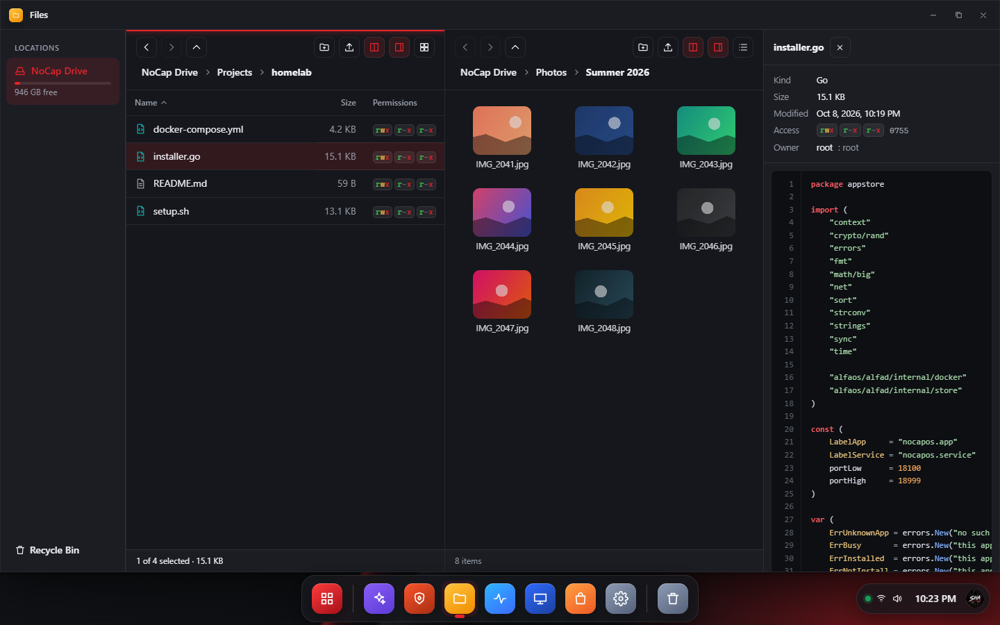
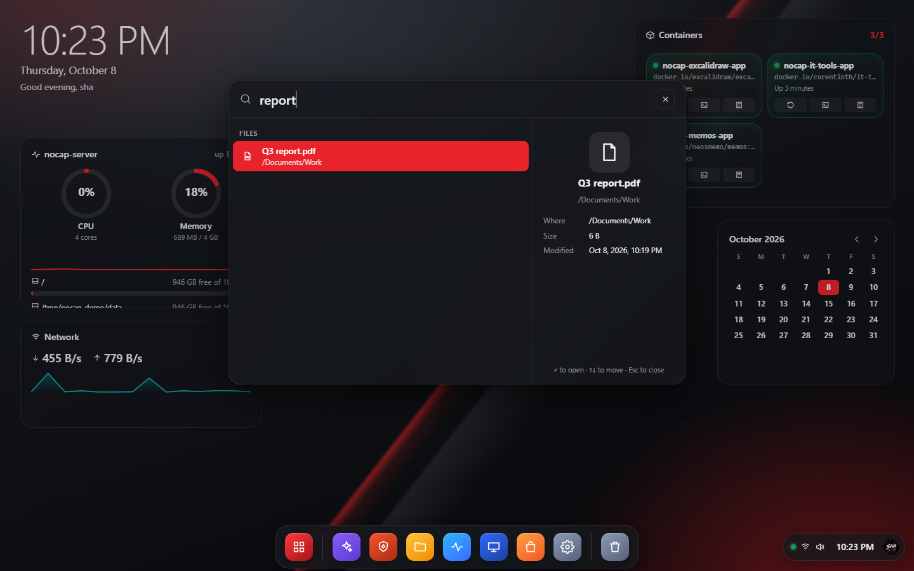
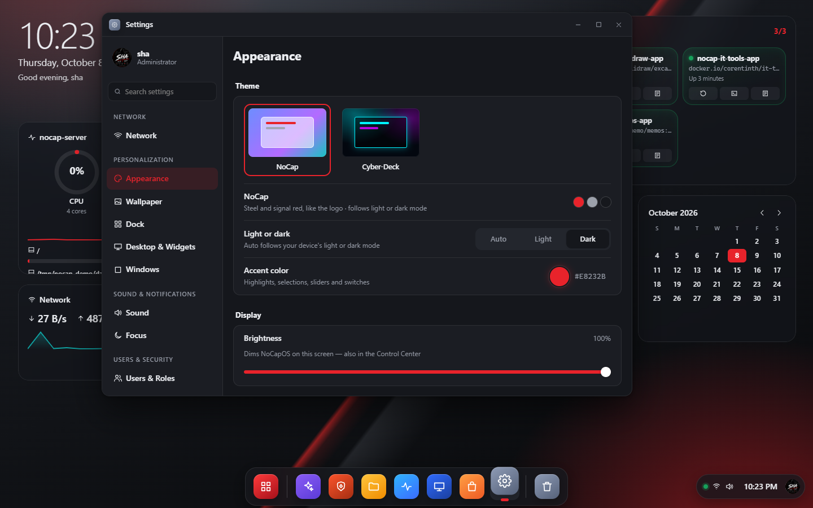
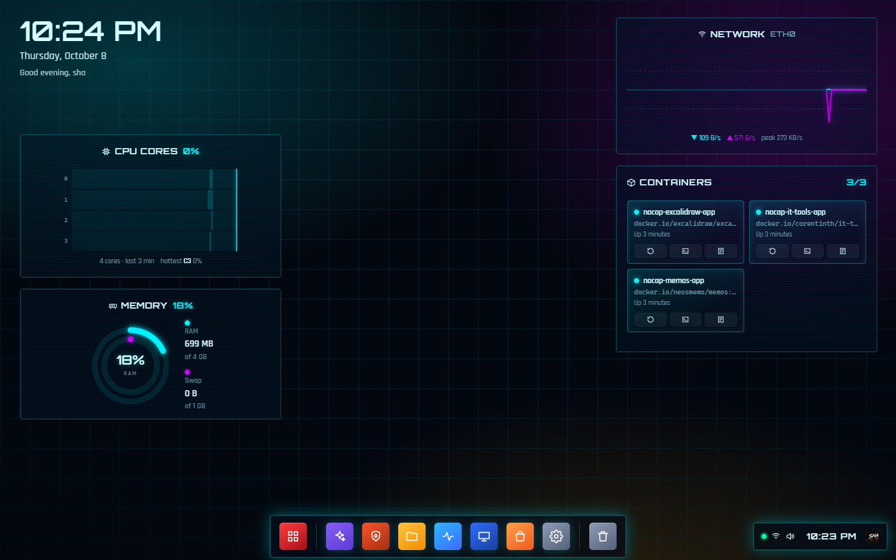

# NoCapOS

[](https://shatheitguy.github.io/nocapos/)
[](../../releases/latest)
[](https://github.com/shatheitguy/nocapos/actions/workflows/ci.yml)
[](LICENSE)

**Freedom to do more.** NoCapOS turns any Linux server into a personal cloud with a desktop in your
browser — like umbrelOS or OpenMediaVault on top of Raspberry Pi OS, but with a full windowed desktop.
It installs on top of your existing Linux, manages the machine as root, and runs apps in Docker.

🌐 **Website:** https://shatheitguy.github.io/nocapos/



## Install

On Debian, Ubuntu, Raspberry Pi OS, Fedora or Arch (amd64, arm64, armv7):

```bash
curl -fsSL https://github.com/shatheitguy/nocapos/releases/latest/download/install.sh | sudo bash
```

The installer picks the build for your CPU, verifies its SHA-256 checksum, installs Docker if it is
missing (for the App Store), sets NoCapOS up as the `nocapos` systemd service and prints the address and
a one-time setup token. Open the address, enter the token and create your administrator.

| Option | |
|---|---|
| `--storage DIR` | folder for NoCap Drive (default `/srv/nocapos`) |
| `--port N` | HTTPS port (default 443) |
| `--no-docker` / `--install-docker` | skip / don't ask about installing Docker |
| `--docker` | run NoCapOS itself in Docker (apps only — no control of the server) |
| `--uninstall [--purge]` | remove NoCapOS; your files are never deleted |

Settings live in `/etc/nocapos/nocapos.env`; manage the service with `systemctl status|restart nocapos`.
Already downloaded a bundle? `tar -xzf nocapos-linux-arm64.tar.gz && sudo bash nocapos-*/install.sh`.

## What you get

- **Desktop in the browser** — windows, dock or taskbar, Launchpad, desktop icons and widgets,
  macOS-style login and lock screen with profile photos, light/dark, the NoCap theme and Cyber-Deck.
- **Your server, managed** — sign in with the machine's Linux accounts (root included), manage users
  and roles, Wi-Fi and network (DHCP/static with automatic rollback), restart and shut down.
- **App Store** — one-click installs of self-hosted apps (Jellyfin, Nextcloud, Open WebUI + Ollama,
  Vaultwarden, Syncthing, Gitea, code-server, n8n, …) with updates and release notes.
- **Files** — dual-pane file manager with previews, syntax highlighting, permission badges, recycle bin,
  uploads, and a *System* view of the whole server where core OS folders are protected.
- **Terminal** — root shell on the host or a shell in any container, in the browser.
- **Containers, Monitor, Logs** — live stats, CPU/GPU/memory/network, container logs.
- **Remote Desktop** (RDP), **Brave** browser, **Scripts** (one-click scripts with output),
  **AI Assistant** (local Ollama or cloud providers).
- **Security** — argon2id passwords, two-factor sign-in, rotating sessions, audit log of every admin
  action, strict Content-Security-Policy.

## Screenshots

| | |
|---|---|
|  **App Store** — one-click apps, updates and release notes |  **Lock screen** — your photo and a cyber cat that covers its eyes while you type |
|  **Files** — dual pane, permissions and code previews |  **Search** — apps, settings, files and actions (Ctrl+Space) |
|  **Settings** — themes, wallpaper, dock, users, network |  **Cyber-Deck** — optional sci-fi theme with holographic widgets |

## Updating

Run the installer again — it upgrades in place and keeps your accounts, settings and files. Every push
to `main` is built by GitHub Actions and published under [Releases](../../releases), so `releases/latest`
always has the newest build.

## Build from source

Requirements: Go 1.25+, Node 20+.

```powershell
.\build.ps1                                   # UI + backend\bin\alfad.exe for this machine
.\package.ps1 -Version 0.2.0                  # Linux bundles in dist\ (amd64, arm64, armv7) + SHA256SUMS
```

```bash
cd frontend && npm install && npm run build   # builds the UI into backend/web/dist
cd ../backend && CGO_ENABLED=0 go build -o bin/alfad ./cmd/alfad
bash scripts/package.sh 0.3.0                 # (from the repo root) Linux bundles in dist/
```

Run it locally with `backend/bin/alfad` and open `http://127.0.0.1:8080`; the first start prints the
setup token. For UI work, `npm run dev` in `frontend/` proxies API calls to a running alfad.

## Layout

```
backend/            alfad — Go daemon, single static binary with the UI embedded
  internal/api        REST + WebSocket API
  internal/appstore   App Store catalog and installer
  internal/accounts   NoCapOS or Linux accounts
  internal/files      storage locations, recycle bin, protection of system folders
  internal/hostctl    network, Wi-Fi, power
  internal/docker     minimal Docker Engine API client
  internal/store      SQLite with migrations
frontend/           React + TypeScript + Vite desktop
deploy/             installer, systemd unit, Docker Compose files
```

## Security notes

- Native installs run as root on purpose, so NoCapOS can manage the machine. Everything that changes
  the system is admin-only and written to the audit log; turn on two-factor sign-in.
- Files refuses to delete, move or rename NoCapOS's own folders and core OS folders.
- App Store apps run as containers with their own volumes; uninstalling keeps data unless you choose
  to delete it.
- File links are short-lived tickets; files that could run script (HTML, SVG) always download instead
  of rendering.

## About the developer


**Sharqan Ahamed, Sha The IT Guy**: Senior IT Infrastructure Engineer and Cloud & Cybersecurity Strategist, Dubai, UAE.
NoCapOS is the home server I wanted: every tool I reach for, on hardware I own, behind one clean desktop.

[shatheitguy.in](https://shatheitguy.in) · [GitHub](https://github.com/shatheitguy) · [LinkedIn](https://ae.linkedin.com/in/sharqan-ahamed-8555b8169) · [YouTube](https://www.youtube.com/@shatheitguy) · [X](https://x.com/Sha_The_IT_Guy)

Also by me: [ALFA Launcher](https://github.com/shatheitguy/alfa-launcher), a sci-fi Android home screen, and [IT-Vault](https://github.com/shatheitguy/it-vault), a self-hosted IT asset register and helpdesk.

## License

NoCapOS is open source under the [MIT License](LICENSE). © 2026 Sharqan Ahamed (Sha The IT Guy).
